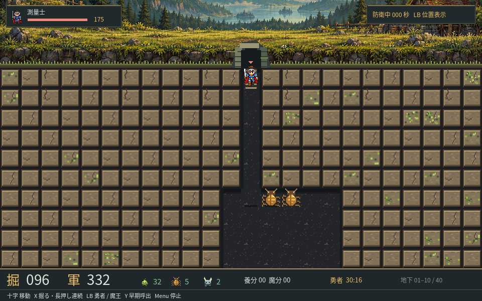

# 深庭 — DEEPGARDEN

Godot 4.7.2 / Windows向け、コントローラー対応の生態系ダンジョン防衛ゲーム。1面試作 v0.5.1（魔物の左向き描画修正版）です。

v0.5.1では魔物の左右反転時に絵が消える・ずれる不具合を修正しました。画面左右4か所、魔物4種を実レンダリングで確認しています。



自作の新勇者の4方向8コマ歩行とアイコンを導入し、旧画像・未使用描画処理を整理しました。攻撃・見回し・喜び・死亡の専用画像は準備中で、新勇者の仮ポーズを使用しています。[素材の入れ替え方](docs/character-assets.md) / [整理内容と検証](docs/cleanup-v0.5.md)。

土を掘り、灯苔 → 琥珀虫 → 石角という食物連鎖を育てて、1人の戦士から「深庭の主」を守ります。捕縛されても、運搬者を出口までに倒せばその場で救出できます。

分岐での停止、突入・捕獲時の待機、方向別攻撃、死亡から骨への切り替えを実装しています。過去の専用モーションの記録は [v0.4開発記録](docs/hero-v0.4.md) を参照してください。

## 起動

### Windowsビルド

配布ZIPを展開し、`Deepgarden.exe`を実行します。Godotのインストールは不要です。実行ファイルはソースリポジトリには含めていません。

### ソースから

1. [Godot 4.7.2 Standard](https://godotengine.org/download/archive/4.7.2-stable/)を用意します（.NET版は不要）。
2. このリポジトリを取得し、Godotの「インポート」で`project.godot`を開きます。
3. インポート完了後、F6ではなく **F5（プロジェクト実行）** を押します。

コマンドラインからも起動できます。

```powershell
godot --path . --editor --import --quit
godot --path .
```

## 画面構成

上部は操作できない地上風景、地下は横24×縦10マスの表示窓です。60×40マスのマップを40px単位でスクロール表示します。右側の大型パネルを廃止し、下部に「掘＝残りの掘削回数」「軍＝現在の魔物の軍事力」、個体数、選択土の養分・魔分をまとめました。侵入者のHPは上部に表示します。

厚みのある土、苔・結晶、通路の壁際の影、魔物、ツルハシカーソルを表示します。勇者は青い鎧の戦士です。十字キー・X・LBの操作と生態系ルールは維持しています。

[画面改修の内容と素材の作成記録](docs/art-direction-v0.2.md)

## 操作

|操作|Xbox系コントローラー|キーボード|
|---|---|---|
|カーソル移動|十字キー|方向キー|
|掘る|X|X|
|連続掘り|Xを押しながら十字キー|Xを押しながら方向キー|
|勇者／主へカメラ切替|LB|Tab|
|開始・魔王配置・決定・リトライ|A|Enter|
|キャンセル・ポーズ解除|B|Esc|
|勇者を早く呼ぶ|Y|Y|
|ポーズメニュー|Menu / Start|P|

- LBを押すと侵入者と主の現在位置へ交互に切り替えます。自動追従はしません。複数侵入者の場合は運搬者、次いで生存している編成順先頭を選びます。
- LBで掘削カーソルは移動しません。十字キーを操作するとカーソルの画面へ戻ります。
- ポーズ画面では再開・リトライ・サウンド切替・終了を選べます。
- コントローラーが切断されると進行を停止します。
- ボタン表記はXbox方式です。物理コントローラーでの対応機種別検証は未実施です。

## 最初の遊び方

1. Aで開始。初期カーソルは入口の下にあります。
2. Xを押しながら下へ掘って通路を延ばします。横にも枝道を掘り、明るい土を探します。
3. 養分1～9で灯苔、10～16で琥珀虫、17以上で石角が生まれます。土の詳細は画面右下で確認できます。
4. 灯苔は土の養分を集め直し、琥珀虫は灯苔を、石角は琥珀虫を食べます。生き物の死亡時には近くの土へ資源が戻ります。
5. 石角は条件がそろうと2×3マスの空間で卵を産みます。卵は9秒で孵化します。
6. 150秒の準備時間が終わるか、Yで侵入者を呼ぶと、主の配置に進みます。
7. 入口とつながった通路の奥を選び、Aで主を配置します。配置中は時間が停止します。
8. 侵入者を全員倒すと勝利。主を運ぶ侵入者が出口へ着くと敗北です。

掘削力がゼロになっても即敗北にはなりません。掘削以外の操作と生態系の防衛は続きます。

## 実装範囲

- 60×40マスの1面。マップデータは高さ72まで対応。
- 3系統＋卵の独自ピクセルアート、基本的な捕食・養分循環・繁殖・空腹・死亡。
- 第一面は戦士1人。将来用2人編成は明示指定のシミュレーションAPIのみ。
- カーソル、連続掘り、LBによる位置切り替え、地下深度表示、ステータス、効果音。
- 準備、到来、配置、戦闘、捕縛、救出、再捕縛、勝敗、報酬、リトライ。
- 固定時間刻みのシミュレーションと描画の分離。
- 準備・戦闘以外は生態系と戦闘タイマーを停止。将来の`upgrade`・`transition`も停止することをテスト済み。

魔分は保持しますが魔分系統の生物は未実装です。全魔物・全スキル、強化画面、次ステージ、永続セーブ、Steam連携、完成版の音楽・会話はこの試作には含みません。グラフィックとバランスは独自の初期案で、原作品質との一致を保証するものではありません。

## 開発・検証

```powershell
# 初回のインポート
godot --headless --path . --editor --import --quit

# シミュレーションと停止・入力ルール
godot --headless --path . --script res://tests/run_tests.gd

# 実際の入力ディスパッチと画面遷移
godot --path . --script res://tests/ui_smoke.gd

# Windowsエクスポート（Godotの対応するExport Templates導入後）
godot --headless --path . --export-release "Windows Desktop" ../Deepgarden-Windows/Deepgarden.exe
```

`tests/ui_smoke.gd`は合成したJoypadイベントをGodotの入力処理へ送り、画面遷移を確認します。実際に物理ボタンを押した検証ではありません。`-- --captures=<既存フォルダーの絶対パス>`を追加すると確認用の画面を保存できます。

構造：`scripts/simulation.gd`＝世界とAI、`scripts/game.gd`＝入力・進行・描画、`assets/`＝独自素材とフォント、`tests/`＝自動テスト。

[承認済み仕様と今回の追記](docs/specification.md) / [検証記録](docs/verification.md)

## 素材・ライセンス

灯苔と新しい戦士はユーザー自作PNGです。土とその他の生物の仮絵はコードで描いた独自の図柄、効果音は合成音です。地上背景は組み込み画像生成ツールで作成しました。原作・Wikiの画像や音声は使用していません。土・生物の素材はPythonとPillowで再生成できます（`tools/build_pixel_art.py`）。効果音はPython標準ライブラリのみの`tools/build_sounds.py`で再生成できます。

- Godot Engine：MIT。`assets/GODOT-LICENSE.txt`、`assets/GODOT-COPYRIGHT.txt`。
- Noto Sans CJK JP：SIL Open Font License 1.1。`assets/FONT-LICENSE.txt`。
- [Godotに含まれる第三者ライセンス](https://godotengine.org/license/)。

原作の攻略情報は挙動を考える参考資料として使い、未解明の部分・数式・探索ルール・報酬は独自仕様にしています。各参考URLは仕様書末尾に記載しています。
