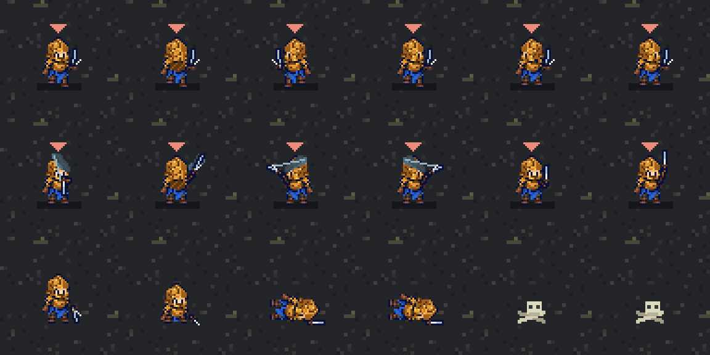

# v0.4 勇者のスプライトと行動

ユーザー自作の `hero-motions-v2.png`（256×352、32×32セル）を原寸のまま使用。第一面は戦士1人で侵入し、回復役は登場しません。将来用の2人編成はシミュレーションAPIで明示した場合だけ残しています。

## シート対応（上から0始まり）

| 行 | 内容 | コマ数 |
| --- | --- | --- |
| 0 / 1 / 2 / 3 | 移動：下 / 上 / 左 / 右 | 各3 |
| 4 | 見回し | 3 |
| 5 / 6 / 7 / 8 | 攻撃：下 / 上 / 左 / 右 | 各8 |
| 9 | 倒れる | 5 |
| 10 | 剣を掲げる | 7 |

左右反転で方向を代用せず、各行を使用。移動以外はループせず最後のコマを保持します。攻撃は14fps、見回し5fps、喜び10fps、死亡7fpsを独自の初期値として設定しました。

## 行動

- 突入：入口に配置した直後、0.7秒剣を掲げてから移動開始。見えるようカメラを入口へ移します。
- 探索：進入元以外に2つ以上の進路がある場所で0.6秒見回します。その場所では一度見回してから進路を選び、同じ場所で見回し続けません。曲がり角だけでは見回しません。戦闘や捕獲が発生した場合はそちらを優先します。
- 捕獲：その場で0.7秒喜び、出口への最短経路で帰ります。帰路の見回しはありません。従来どおり同じマスの魔物に阻まれると攻撃します。
- 攻撃：対象の方向に合わせた8コマ。約0.29秒の接触時に攻撃判定と斬撃を出します。対象が死亡・離脱した場合は空振り。演出中も魔物は行動し、勇者は被弾します。
- 死亡：倒れる5コマを再生し、0.85秒後に頭蓋骨と骨へ切り替え。骨は元シートに含まれていないため仮描画です。`bones`アニメーションをカタログへ登録すると画像に置換できます。
- 勝利：最後の勇者の場所を表示し、倒れる→骨を見せた後、1.4秒でリザルトを開きます。この間も世界は停止しています。

一時停止・強化・遷移中の生態系停止、十字・X・LB操作を維持しています。

## 検証

既存ロジック54、描画13、勇者の行動・攻撃接触・停止36、実入力経路14の計117項目。Godot実画面で方向別の移動/攻撃、見回し、喜び、倒れから骨を確認。物理コントローラーは未検証です。

独立監査で指摘された斬撃の先行と、魔王・マーカーが移動本体から離れる問題を修正。マーカーと運搬中の主にも勇者と同じ補間座標を使います。

上段は移動4方向と見回し2コマ、中段は攻撃4方向と喜び2コマ、下段は倒れる4時点と骨2時点。画像は実Godot描画を切り出して最近傍で3倍表示した検証用です。
